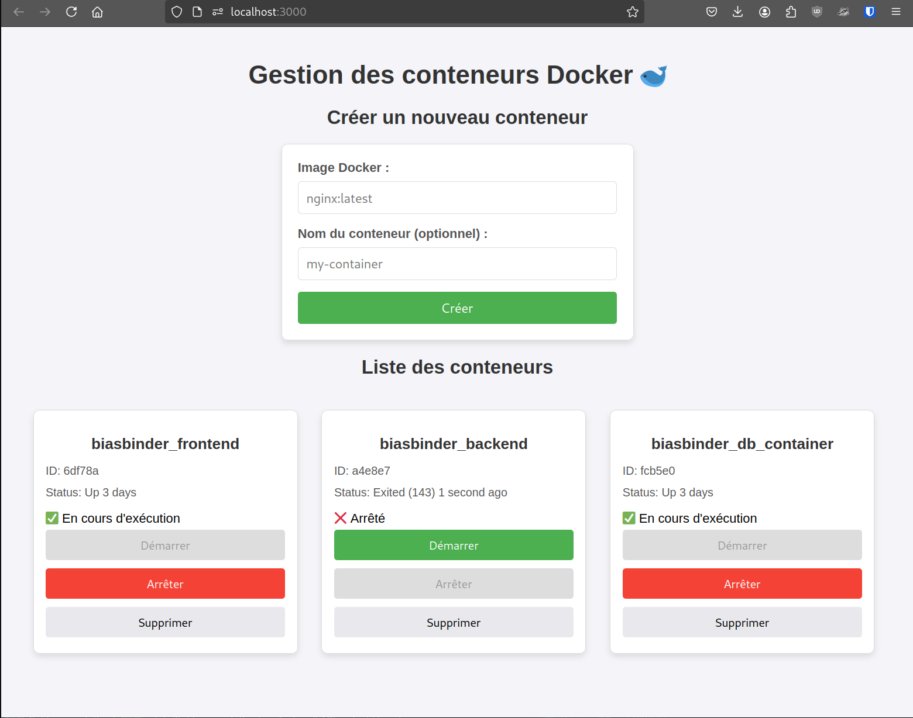

DAI Lab - HTTP infrastructure - Documentations
=============================

Students
----------
- Fehlmann Dylan
- Halimi Elbunita
- Stelcher Stan

Introduction
----------
TO COMPLETE : Add a summary of the project with the main goals and the technologies used from each step.

Static Website
----------
The docker image containing the static HTTP server nginx is in the [static_server](static_server) folder.

A more detailed description of the website and of the configuration of the nginx server can be found in the [static_server/README.md](static_server/README.md) file.

Docker compose
----------
The [docker-compose](docker-compose.yml) file can be found in the root of the project. It contains the configurations to deploy the different services of the project.

The services are:
- static_server
- ...

Commands to run the project are:
```
docker-compose up

```

To build the project:
```
docker-compose up -d --build 
```


To stop the project:
```
docker-compose down
```


HTTP API server
----------
This report details the implementation of an HTTP API server built using Javalin. The API manages a collection of Photocards and provides CRUD (Create, Read, Update, Delete) operations. The API is integrated with a PostgreSQL database and is containerized using Docker for easy deployment.
You will find the detailed description of the API server in the [app-dai/README.md]([app-dai/README.md) file.

TO COMPLETE [app-dai/README.md]([app-dai/README.md) file.


Step 4: Reverse proxy with Traefik
----------


Step 5: Scalability and load balancing
----------


Step 6: Load balancing with round-robin and sticky sessions
----------


Step 7: Securing Traefik with HTTPS
----------


Optional step 1: Management UI
------------------------------



### Build the Docker Image


Navigate to the app-docker-ui/ and build the Docker image using Docker Compose.

```
docker-compose build
```

### Start the Application

After the build is complete, start the application using the following command:

```
docker-compose up
```

### Access the Application

Once the container is up and running, access the application by visiting:

http://localhost:3000

Now you can manage your containers


Optional step 2: Integration API - static Web site
--------------------------------------------------

Home :

    GET /api/groupslist: Fetches a list of groups for the filter.
    GET /api/groups/{groupFilter}/artists: Fetches artists for a selected group, to filter by artist.
    GET /api/photocards?page={page}&size={size}&groupId={groupFilter}&artistId={artistFilter}: Retrieves photocards based on pagination, group, and artist filters.
    GET /api/users/{userId}/collection: Fetches the collection (wishlist/owned) of the current user.
    POST /api/users/{userId}/photocards: Adds or removes a photocard to/from the user's collection (owned/wishlist).
    POST /api/user/photocard: Adds/removes a photocard from the user's collection based on the action (have set to true for owned or false for wishlist).

User Profile :

    GET /api/users/{userId}/collection: Retrieves the list of owned photocards.
    GET /api/users/{userId}/wishlist: Retrieves the list of wishlist photocards.

Admin Page :

    GET /api/proposedphotocards: Retrieves the list of proposed photocards.
    PATCH /api/admin/accept: Accepts the selected photocards.
    PATCH /api/admin/reject: Rejects the selected photocards.